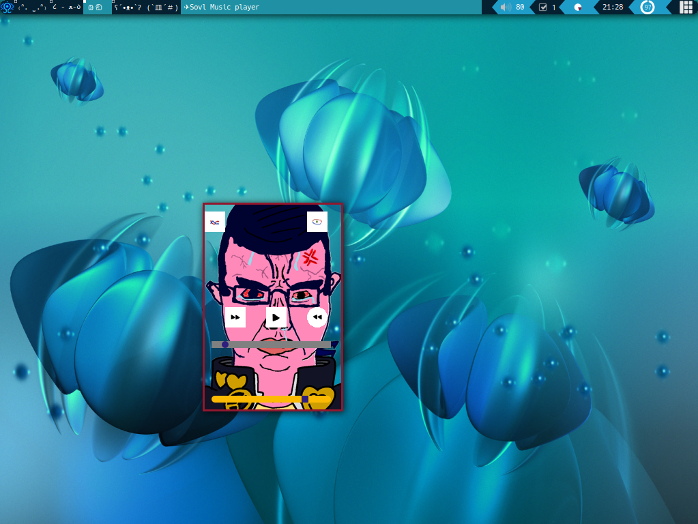
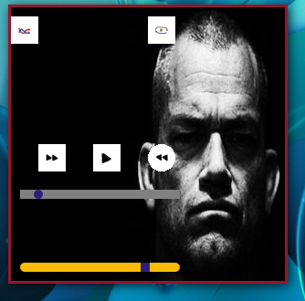

# SOVL

### A mpc GUI

Change / add any button or slider you want editing the config file
Change the function / look of every widget

---
## Config
---
Window configuration

**[Window]**

x="location of the window "	***int***

y="location of the window "	***int***

Heigth="Heigth of the window"	***int***

Width="Width of the window"	***int***

Image="Background image of the window"     ***Absolute path***

**[ButtonX]** ***Declaration of a Button, Where "X" could be any number o string for this configuration just is requiered to start with "Button"***

x="location of the button inside the window "	***int***

y="location of the button inside the  window "	***int***

Heigth="Heigth of the button inside the  window"	***int***

Width="Width of the button inside the  window"	***int***

Image="Background image of the Button"     ***Absolute path***

func= "Function for the button"  ***play_pause, shuffle, prev, next, random, repeat***

**[Slider]** 

x="location of the slider inside the window "	***int***

y="location of the slider inside the  window "	***int***

Heigth="Heigth of the slider inside the  window"	***int***

Width="Width of the slider inside the  window"	***int***

func= "Function for the button"  ***progress/vol ***

color= "Any color in rgb, hex or name", ***Change the color of the bar***

border_radious="Radious of the slider" ***int***

border_radious_handles="Radious of the handler" ***int***

## Optional

+ **pamixer**: for volume control
